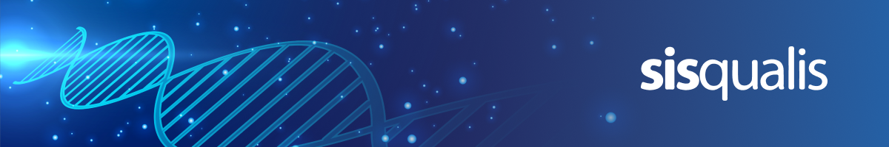

  

  <h3>🚀 Tecnologia para impulsionar o crescimento, a inovação e a transformação na saúde 🚀</h3>

---

## 🏢 Sobre Nós

**A Sisqualis** nasceu com o propósito de elevar o nível da gestão de informações e processos por meio de soluções tecnológicas avançadas. Combinamos a energia de uma start-up com a maturidade de quem entende a complexidade de projetos de missão crítica.

🏛️ **Localização:** Com sede no **Tecnopuc**, um dos maiores polos de tecnologia e inovação do Brasil

🎯 **Foco:** Desempenho e escalabilidade, entregando sistemas que:
- ✅ Facilitam fluxos de trabalho
- ✅ Aumentam a produtividade 
- ✅ Garantem a segurança das informações

🇧🇷 **Posicionamento:** Fazemos parte da vanguarda brasileira em soluções de barramento e interoperabilidade de dados, atendendo os principais desafios das equipes de TI de saúde e normas de proteção e privacidade, incluindo a **LGPD**.

---

## 📚 O que você encontrará aqui?

Este espaço é dedicado a compartilhar recursos e documentações sobre nossas soluções. Nosso objetivo é fornecer acesso rápido e claro às informações que você precisa.

### 📘 Manuais e Documentação do Fusion

  

Acesse nossa documentação técnica completa e guias de uso através do nosso portal de documentos.

**🔗 Link:** [docs-fusion.sisqualis.com.br](https://docs-fusion.sisqualis.com.br)

### 🔒 Repositório de Manuais Fusion (Privado)

  

Este repositório contém manuais detalhados e materiais de apoio. O acesso é restrito para garantir a segurança das informações.

**🔗 Link:** [github.com/SISqualis/manuais-fusion](https://github.com/SISqualis/manuais-fusion)

**⚠️ Controle de Acesso:** O acesso a este repositório é concedido apenas a usuários autorizados. Se você precisa de acesso, certifique-se de que recebeu um e-mail de convite para colaborar.

---

  <h3>💡 Estamos aqui para construir com você a próxima geração de soluções tecnológicas 💡</h3>
  
  

    
    
    
  

